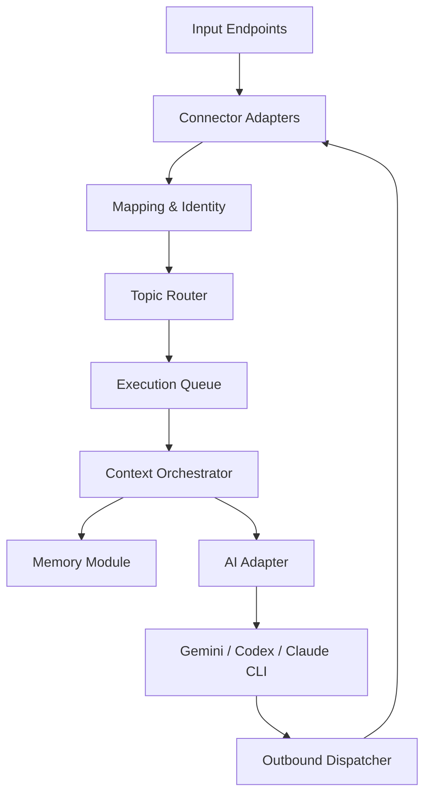
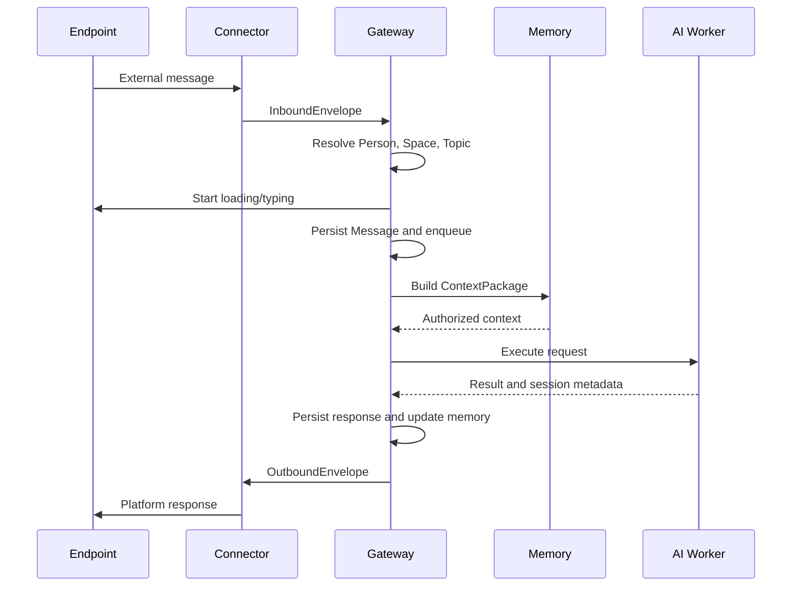

# AI CLI Gateway 設計稿

**版本**：0.1（討論稿）  
**日期**：2026-09-16  
**狀態**：Proposed／尚有待確認決策  

## 1. 目的

建立一個可由 LINE、Telegram、自製 CLI 或未來其他輸入端呼叫 Gemini CLI、Codex CLI、Claude CLI 等 AI 執行器的 Gateway。

系統需具備下列能力：

- 同一個人可綁定多個平台身分。
- 不同平台的私人聊天或群組可連結到相同的內部討論主題。
- Topic 可跨輸入端共享訊息背景與主題記憶。
- 記憶系統獨立演進，未來可加入語意檢索、圖狀關係、強化、衰減及遺忘。
- AI CLI session 可以用來延續上下文，但不可成為唯一的歷史與記憶來源。
- 輸入平台、記憶實作及 AI Provider 可以分別替換或擴充。

## 2. 核心設計原則

1. **內部模型不依賴平台 ID**：LINE `userId`、Telegram `chat.id` 等僅存在於整合層。
2. **外部識別採可擴充格式，內部識別採固定型別**：External Key 可使用 JSON；`PersonId`、`SpaceId`、`TopicId` 等不可使用動態 JSON。
3. **Connector 負責解析與正規化，不負責跨平台身分判定**：跨平台合併、解除綁定及權限由核心 Mapping 模組處理。
4. **Memory 與 Chat History 分離**：原始訊息、對話摘要、長期記憶和 Provider session 是不同資料。
5. **Memory 輸出結構化內容**：Memory 模組產生 `ContextPackage`，AI Adapter 再依 CLI 能力渲染為 prompt 或 CLI 參數。
6. **CLI session 是最佳化，不是真相來源**：session 遺失、版本不相容或切換 Provider 時，系統仍可重建必要上下文。
7. **同一 Topic 的訊息依序執行**：避免多人同時發問造成 CLI session 歷史交錯。

## 3. 名詞與領域模型

| 名稱 | 說明 |
| --- | --- |
| `Person` | Gateway 內部識別的一個人 |
| `ExternalIdentity` | Person 在特定 Connector 上的外部身分，例如 LINE userId |
| `Space` | 成員與權限邊界，可代表個人空間、家庭或團隊共享空間 |
| `ExternalChat` | 平台上的聊天入口，例如 LINE groupId、Telegram chat.id |
| `ExternalThread` | 平台原生子討論串，例如 Telegram `message_thread_id` |
| `Topic` | Gateway 內部、可跨平台持續討論的主題 |
| `Message` | 正規化後的輸入或輸出訊息 |
| `AiSession` | Topic 對某一 AI Provider／CLI 的延續 session |
| `Execution` | 一次實際 AI CLI 執行 |
| `Memory` | 可在未來被召回的獨立記憶單元 |

建議以 `Person / Space / Topic` 取代 `User / Group / Conversation`：

- `Person` 比 User 更明確地表示跨平台後的同一個人。
- `Space` 同時涵蓋個人與多人情境，不受 LINE／Telegram 聊天類型限制。
- `Topic` 表示長期主題，適合跨 Space、跨平台共享。
- 若未來需要把 Topic 中的長期討論切成階段，可再增加 `Thread` 或 `Conversation`，目前不必先建立。

## 4. 高階架構



建議部署元件：

- Gateway API：接收 webhook、驗證簽章及快速回應。
- Worker：處理 Topic routing、context 組合與 AI 執行。
- PostgreSQL：核心資料、訊息、映射、session metadata。
- Redis：Queue、Topic lock、短期狀態及取消訊號。
- Provider Worker／Sandbox：執行各家 AI CLI。

初期使用 Docker Compose。Gateway 與 Worker 長駐；每次請求建立新的 CLI process。未來若開放檔案修改或 Shell 工具，再升級為每個 Execution／Workspace 的隔離 Sandbox Container。

## 5. 輸入模組

### 5.1 Connector 的責任

每個輸入端實作共同介面，負責：

- 驗證 webhook 或本地呼叫來源。
- 將平台事件解析成固定的 `InboundEnvelope`。
- 將平台特有 ID 正規化為穩定的 External Key。
- 下載或取得平台附件。
- 提供發送訊息、編輯訊息、活動指示器等能力。
- 提供外部位址的序列化與反序列化。

Connector **不應自行判定**兩個外部帳號是否為同一個 Person，也不應自行實作跨平台 Topic 權限。

```csharp
public interface IMessageConnector
{
    string ConnectorType { get; }

    Task<InboundEnvelope> ParseAsync(
        ConnectorRequest request,
        CancellationToken cancellationToken);

    Task SendAsync(
        OutboundEnvelope message,
        CancellationToken cancellationToken);

    Task<IAsyncDisposable?> BeginActivityAsync(
        ExternalChatAddress chat,
        ActivityType activity,
        CancellationToken cancellationToken);
}
```

### 5.2 固定的內部訊息格式

```csharp
public sealed record InboundEnvelope(
    string ConnectorType,
    string ConnectorInstanceId,
    ExternalKey Actor,
    ExternalKey Chat,
    ExternalKey? Thread,
    ExternalKey Message,
    MessageContent Content,
    DateTimeOffset OccurredAt,
    JsonDocument RawMetadata);
```

`RawMetadata` 只保留追蹤、除錯及尚未正規化的資訊。Application Core 不應依賴其中的 LINE／Telegram 欄位。

### 5.3 External Key

不同平台 ID 結構不同，因此可採 JSONB：

```json
{
  "userId": "U123456"
}
```

```json
{
  "chatId": -1001234567890,
  "messageThreadId": 246
}
```

```json
{
  "machine": "dev-pc-01",
  "profile": "saintber"
}
```

但不可只靠 JSON 文字直接比較。Connector 必須另外產生 deterministic canonical key：

```csharp
public sealed record ExternalKey(
    string Kind,
    string CanonicalValue,
    JsonDocument Properties);
```

例如：

```text
LINE person   → line:user:U123456
LINE group    → line:group:C987654
Telegram user → telegram:user:123456789
Telegram chat → telegram:chat:-1001234567890
CLI profile   → cli:dev-pc-01:saintber
```

資料庫可保存 `Properties JSONB`，並對 `CanonicalValue` 或其 hash 建立唯一索引，以避免 JSON 欄位順序造成相同識別被視為不同資料。

### 5.4 Mapping 模組

Mapping 模組集中處理 external-to-internal resolution：

```csharp
public interface IExternalMappingService
{
    Task<PersonId> ResolvePersonAsync(
        ExternalIdentityKey identity,
        CancellationToken cancellationToken);

    Task<SpaceId> ResolveSpaceAsync(
        ExternalChatKey chat,
        CancellationToken cancellationToken);

    Task<TopicRoutingResult> ResolveTopicAsync(
        TopicRoutingRequest request,
        CancellationToken cancellationToken);

    Task<ExternalChatAddress> ResolveOutboundAddressAsync(
        ExternalChatId externalChatId,
        CancellationToken cancellationToken);
}
```

建議映射表：

```text
ExternalMappings
- Id
- ConnectorType
- ConnectorInstanceId
- ExternalKind
- ExternalKeyJson
- ExternalKeyHash
- InternalEntityType
- InternalEntityId
- MetadataJson
- VerifiedAt
- CreatedAt
```

唯一索引：

```text
(ConnectorType, ConnectorInstanceId, ExternalKind, ExternalKeyHash)
```

`ConnectorInstanceId` 不可省略，因為同一平台可能有多個 Bot／Official Account，平台 ID 的作用域不應被假設為全域一致。

### 5.5 跨平台 Person 綁定

不可依顯示名稱自動合併。建議使用短效連結碼或由管理者確認：

```text
LINE：/link telegram
Gateway：產生 A7K9P2
Telegram：/link A7K9P2
```

驗證成功後，兩筆 ExternalIdentity 指向相同 `PersonId`。

### 5.6 等待狀態

- LINE 私聊：呼叫 `POST /v2/bot/chat/loading/start` 顯示原生彩色 loading animation。
- Telegram：週期性呼叫 `sendChatAction(typing)`；狀態維持時間短，工作完成或取消時停止更新。
- 自製 CLI：顯示 spinner 或 execution status。

等待狀態屬於 Connector 能力，不應寫入 Memory 或正式 Message History。

## 6. Space 與 Topic

### 6.1 Space

Space 是權限與成員邊界：

```text
Personal Space：Saintber
Shared Space：MAS 團隊
Shared Space：家庭
```

同一個 Space 可有多個 ExternalChat：

```text
MAS 團隊 Space
├── LINE MAS 群組
├── Telegram MAS 群組
└── 未來 Web Portal
```

### 6.2 Topic

Topic 是可跨入口共享的主題：

```text
Topic：MAS Migration
├── LINE MAS 群組
├── Telegram / Forum Topic 246
└── Saintber 的 LINE 私聊
```

建議採多對多：

```text
SpaceTopics
- SpaceId
- TopicId
- AccessLevel
- IsDefault
```

存取 Topic 時必須同時驗證：

```text
Person 可以存取 Topic
AND
目前來源 Space 可以存取 Topic
```

避免使用者在私人入口可讀取的資訊，因為他在另一個群組發問而被意外帶入群組。

### 6.3 Topic 選擇策略

可依序判定：

1. 訊息明確指定 `/topic xxx` 或 `#xxx`。
2. ExternalThread 已固定綁定 Topic，例如 Telegram Forum Topic。
3. ExternalChat 的 active Topic。
4. ExternalChat 的 default Topic。
5. 尚無 Topic 時建立 Inbox／General Topic，或要求使用者選擇。

群組的 active Topic 初期建議全群組共用；若每個成員各自有 active Topic，成員看到相同聊天室內容卻得到不同 AI 上下文，行為較難理解。

## 7. Memory 模組

### 7.1 模組邊界

Memory 模組負責：

- 從 Message、摘要、外部知識或人工輸入建立記憶。
- 依 Person、Space、Topic、查詢語意及權限召回記憶。
- 排序、去重、強化、衰減、遺忘及處理矛盾。
- 保存 Evidence 與來源，以便追溯記憶依據。

Memory 模組不負責：

- 接收 LINE／Telegram webhook。
- 決定使用哪一個 AI Provider。
- 直接呼叫 CLI。
- 產生各 Provider 專屬命令列參數。
- 將所有內容直接拼成不可解析的一大段文字。

### 7.2 可替換的記憶來源

```csharp
public interface IMemorySource
{
    string SourceType { get; }

    Task<IReadOnlyList<MemoryCandidate>> RecallAsync(
        MemoryRecallRequest request,
        CancellationToken cancellationToken);
}
```

可能實作：

- `RecentMessageMemorySource`
- `ConversationSummaryMemorySource`
- `RelationalMemorySource`
- `VectorMemorySource`
- `GraphMemorySource`
- `StaticInstructionMemorySource`
- `ExternalKnowledgeMemorySource`

由 Memory Orchestrator 聚合多個來源，再進行權限過濾、相關性排序、去重及 token budget 分配。

### 7.3 記憶 Scope

記憶至少支援：

| Scope | 範例 |
| --- | --- |
| Person | 使用者偏好 xUnit |
| Space | MAS 團隊共識與規範 |
| Topic | PostgreSQL 遷移的決策與進度 |
| Global | Gateway 全域規則或公共知識 |

每次 Recall 必須包含請求者與來源 Space：

```csharp
public sealed record MemoryRecallRequest(
    PersonId RequesterId,
    SpaceId SourceSpaceId,
    TopicId TopicId,
    string CurrentInput,
    ContextBudget Budget);
```

### 7.4 ContextPackage

Memory／Context Orchestrator 應輸出固定物件，而不是直接輸出 Provider 專用 prompt：

```csharp
public sealed record ContextPackage(
    SystemContext System,
    ActorContext Actor,
    TopicContext Topic,
    ConversationContext Conversation,
    IReadOnlyList<RetrievedMemory> RelatedMemories,
    IReadOnlyList<ContextArtifact> Artifacts,
    CurrentInput CurrentInput,
    ContextDiagnostics Diagnostics);
```

建議區段：

1. **System Context**：Gateway 規則、安全限制、角色與輸出要求。
2. **Actor Context**：目前 Person 的公開偏好與必要資料。
3. **Topic Context**：Topic 目標、共識、未解決事項及目前狀態。
4. **Conversation Context**：近期訊息、滾動摘要或 session 重建資料。
5. **Related Memories**：依查詢動態召回的關聯背景。
6. **Artifacts**：檔案、程式碼庫、URL 或其他工作資源描述。
7. **Current Input**：本次使用者輸入，必須與記憶內容明確分隔。
8. **Diagnostics**：來源、token 估算、截斷及召回理由；通常不送給模型，只供觀測。

Memory 回傳的每項內容應保留：

```text
- MemoryId
- Content
- Scope
- Relevance
- Importance
- Confidence
- Visibility
- EvidenceIds
- TokenEstimate
```

### 7.5 AI CLI session 下的 Context 策略

不能單純規定「有 CLI session 就不帶目前對話內容」，應依 session 狀態決定：

| Session 狀態 | 傳入內容 |
| --- | --- |
| Healthy resume | Current Input + 新召回背景；避免重複傳入完整近期對話 |
| New session | System + Topic summary + 近期對話 + Related Memories + Current Input |
| Lost／invalid | 以 summary 與近期訊息重新 hydrate，再建立新 Provider session |
| Provider switch | 使用 Gateway 保存的內容重建，不依賴上一家 Provider session |
| Context compacted | 更新 Topic／Conversation summary，保存 compaction checkpoint |

Gateway 必須保存原始 Message History 與摘要；CLI session 只保存：

```text
AiSessions
- TopicId
- Provider
- ProviderAccountId
- ExternalSessionId
- WorkspaceId
- CliVersion
- Status
- LastUsedAt
```

### 7.6 未來網狀記憶

初期可使用 PostgreSQL + pgvector，但資料模型應預留：

```text
Memories
- Id
- Content
- Type
- ScopeType
- ScopeId
- Importance
- Confidence
- DecayRate
- LastRecalledAt
- RecallCount
```

```text
MemoryRelations
- SourceMemoryId
- TargetMemoryId
- RelationType
- Strength
- LastReinforcedAt
```

```text
MemoryEvidence
- MemoryId
- MessageId
- SourceType
- CreatedAt
```

未來更換 Graph DB 時，由 Memory 模組內部替換實作，上層仍使用 `IMemorySource`／`IMemoryService`。

## 8. AI Adapter 與 Prompt Rendering

AI Adapter 接受 `ContextPackage`，負責：

- 判斷是否 resume 明確的 Provider session ID。
- 將結構化 context 渲染為該 Provider 適合的 prompt。
- 選擇非互動、JSON 或串流輸出模式。
- 處理 timeout、取消、exit code 及輸出解析。
- 回傳新的 session ID、回答、工具事件及 usage metadata。

```csharp
public interface IAiAdapter
{
    string Provider { get; }

    Task<AiExecutionResult> ExecuteAsync(
        AiExecutionRequest request,
        CancellationToken cancellationToken);
}
```

```csharp
public sealed record AiExecutionRequest(
    ContextPackage Context,
    string WorkspacePath,
    string? ProviderSessionId,
    AiExecutionPolicy Policy);
```

Provider Adapter 不得自行從所有 Person／Space memory 中任意查詢資料；它只能使用已完成權限判斷的 `ContextPackage`。

## 9. 訊息處理流程



詳細步驟：

1. Connector 驗證並解析平台事件。
2. Mapping Service 將 ExternalIdentity／ExternalChat 解析為 Person／Space。
3. Topic Router 決定 Topic。
4. 使用平台 message ID 做冪等檢查。
5. 保存原始與正規化 Message。
6. 啟動平台原生 loading／typing。
7. 將 Execution 放入 Queue。
8. Worker 取得 Topic distributed lock。
9. Context Orchestrator 取得 session 狀態並召回 Memory。
10. AI Adapter resume 或建立 CLI session。
11. 保存回答、工具事件及新的 session metadata。
12. 非同步進行摘要、記憶擷取與強化。
13. Connector 回傳結果並停止等待狀態。
14. 釋放 Topic lock。

## 10. 核心資料表草案

```text
Persons
ExternalIdentities
Spaces
SpaceMembers
ExternalChats
ExternalMappings
Topics
SpaceTopics
ExternalChatTopicBindings
Messages
TopicSummaries
AiSessions
Executions
Memories
MemoryRelations
MemoryEvidence
```

重要約束：

- 外部 message ID 必須有唯一索引，避免 webhook 重送造成重複執行。
- 同一 Topic 同時間原則上只能有一個會修改 session 的 Execution。
- Message、Memory、AiSession 不得互相取代。
- 所有 Memory recall 必須經過 Person + SourceSpace + Topic 權限判斷。
- 外部原始 JSON 可保存供除錯，但不應成為核心業務查詢的唯一資料來源。

## 11. 安全與操作限制

AI CLI 可能讀寫檔案及執行 Shell，因此 Gateway 等同遠端 Agent 執行平台。至少需要：

- Person／Space allowlist 與角色權限。
- Provider credential 隔離。
- Workspace 隔離，不掛載整個 host home。
- Container 非 root，禁止掛載 Docker socket。
- Command timeout、CPU／RAM／磁碟／process 限制。
- 危險工具人工核准策略。
- 網路 egress 限制。
- `/cancel` 可終止整個 process tree。
- Message、Memory、Execution 完整稽核紀錄。
- 記憶刪除、匯出與保存期限政策。

## 12. 建議實作階段

### Phase 1：單平台、單 Provider

- Telegram 或 LINE Connector。
- Person／Space／Topic 內部 ID。
- External Mapping Service。
- PostgreSQL Message History。
- 一個 AI CLI Adapter。
- Queue、Topic lock、loading／typing。
- CLI session ID 保存及明確 resume。

### Phase 2：跨平台

- 第二個 Connector。
- Person account linking。
- 多 ExternalChat 對同一 Space／Topic。
- Topic 指令與 default／active Topic。

### Phase 3：Memory v1

- Recent message、summary、static instruction。
- ContextPackage、token budget、來源追蹤。
- Person／Space／Topic scope。

### Phase 4：進階記憶

- pgvector 語意檢索。
- MemoryRelation 與 Evidence。
- 強化、衰減、矛盾與遺忘。
- 評估是否需要 Graph DB。

### Phase 5：安全 Agent 執行

- Workspace／Sandbox Container。
- 檔案與 Shell 權限政策。
- 多 Provider routing、fallback 與成本控制。

## 13. 待確認決策

以下項目目前不影響架構稿成立，但實作前應確認：

1. **Topic 分享方式**：Topic 是否能由多個 Space 同時寫入，還是部分 Space 只能讀取？
2. **私聊加入共享 Topic**：使用者從個人 Space 進入團隊 Topic 時，回答是否能包含團隊共享記憶？預設建議可以，但仍受 Topic ACL 控制。
3. **群組 Topic 切換**：採全群組 active Topic，還是強制每次以 `/topic` 指定？初期建議全群組共用。
4. **Person 綁定核准**：只允許本人雙端驗證，或允許管理員人工合併？
5. **記憶寫入策略**：自動寫入、AI 提議後寫入，或使用者明確 `/remember`？初期建議「明確指令 + 高信心候選記憶」。
6. **CLI 的實際權限**：只問答、可讀檔、可修改 repository、或可執行任意 Shell？這會決定是否一開始就需要 Sandbox。
7. **Topic 與 Workspace 關係**：一個 Topic 是否固定一個 workspace，或可切換多個 repository／workspace？
8. **AI 回答可見性**：同一 Topic 從 LINE 與 Telegram 使用時，是否只回覆來源入口，還是同步廣播到其他綁定入口？初期建議只回來源入口。

## 14. 本版結論

目前建議採用的穩定核心如下：

```text
輸入整合：Connector Adapter
外部映射：External Mapping Service
內部主體：Person / Space / Topic
對話事實：Message History
上下文產生：Context Orchestrator
獨立記憶：Memory Module
模型整合：AI Adapter
執行延續：AiSession
單次工作：Execution
```

使用動態 JSON 保存外部 ID 是合理的，但必須搭配 Connector 產生的 canonical key/hash；固定 internal ID 不應採 JSON。Memory 支援多來源與多版本也是合理的，但應先輸出固定、可檢查的 `ContextPackage`，再由 AI Adapter 決定是否傳入近期對話、摘要、關聯記憶或只延續既有 CLI session。
