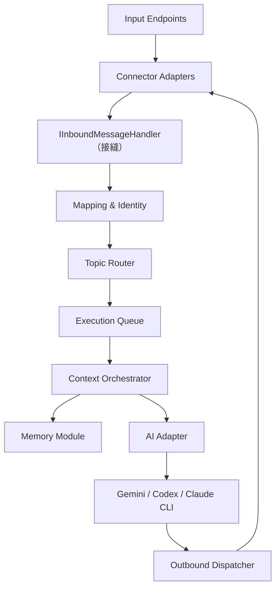
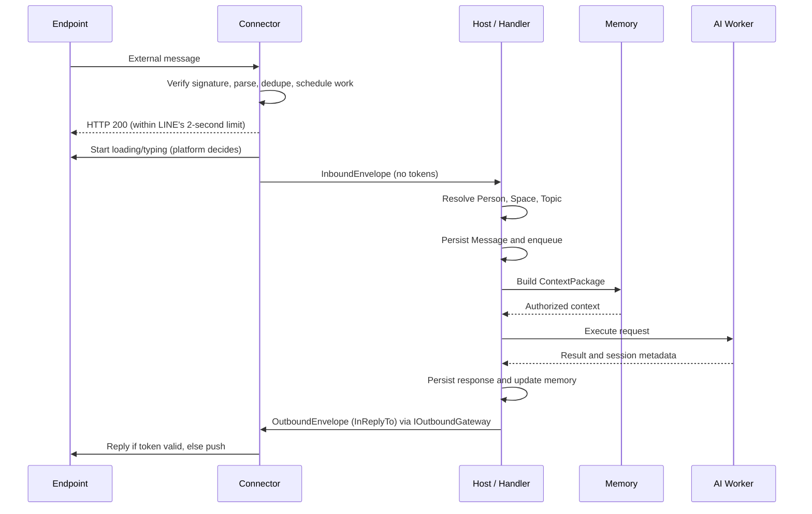

# Assistant 設計稿

**版本**：0.2（討論稿）  
**日期**：2026-10-01（2026-09-30 初版；10-01 依規格審閱與討論同步 Connector 結構）  
**狀態**：Proposed／尚有待確認決策  
**前一版**：[ai-cli-gateway-design-v0.1.md](./ai-cli-gateway-design-v0.1.md)（保留不動，供對照決策來由）

## 0. 與 v0.1 的差異

| 項目 | v0.1 | v0.2 |
| --- | --- | --- |
| 名稱 | AI CLI Gateway | **Assistant**（完整設計比較接近助理而非單純閘道）；命名空間 `Saintber.Assistant.*`，目錄 `assistant/` |
| 接 webhook 的進程 | Gateway API | **Assistant.Host** |
| 技術棧 | 僅範例為 C# | **.NET 10 LTS、ASP.NET Core Minimal API、xUnit**（正式決定） |
| 部署 | Docker Compose | **Docker 與 Podman 皆支援**（`Containerfile` + `compose.yaml`，僅使用兩者共通功能） |
| CI | 未提及 | **GitHub Actions：restore → build → test → 建置容器映像**（不含發佈） |
| Connector 責任 | 驗證來源 | 明確化：**webhook 驗簽在 Connector 內完成**，Host 不理解簽章格式 |
| Connector 與核心的接縫 | 未定義 | 新增 `IInboundMessageHandler` |
| Phase 1 | 單一大階段 | 拆出 **1a：LINE 串接**，作為第一個獨立 change |
| 冪等 | PostgreSQL 唯一索引 | 1a 先用**記憶體去重＋TTL**，且去重由**通用 Connector 內部**以平台事件編號處理，Host 與核心不接觸事件編號；持久化留待有資料庫的階段 |
| Host 與 Connector 的邊界 | Connector 回傳 envelope，Host 處理驗簽後事務 | Host 只認得**收**（`IInboundMessageHandler`）與**發**（`IOutboundGateway`）兩個介面；reply token、loading、reply／push 選擇全部留在 Connector |
| Connector 型態 | 單一介面 | 每個 Connector 為**獨立 dll**，啟動時依組態載入（執行中熱載入列為後續）；`Connectors.Core` 提供**通用 Webhook 型** Connector，平台只實作 `IMessagingPlatform`（送端聯集：Reply、Push、Activity，附能力宣告）與 `IWebhookInbound`（驗簽、解析）；輪詢型通用 Connector 待 Telegram／CLI 出現再做，契約已預留 |
| 回覆方式 | 僅 reply | reply 憑證短效（LINE 約 1 分鐘）；AI 階段執行時間不可預期，必須以 **push** 主動發訊。`OutboundEnvelope` 以 `InReplyTo` 對應訊息，由 Connector 決定用 reply（憑證有效時）或 push |
| webhook 回應 | 流程中同步處理 | LINE 要求 webhook 在 **2 秒內**回應（官方將逾時列為 `request_timeout`）；因此 Connector **先回 200**，再於 Connector 內部（記憶體、有並行與等待上限、停止時清理）處理事件。這不是 Host 與 Connector 之間的發送佇列 |
| reply 脈絡 | 未定義 | reply token 與原始 Chat、有效起點（`min(收到時間, 事件時間)`）、已用旗標保存在 Connector 私有快取；**Chat 為準**（Chat 與原始不符則 push 到 envelope 的 Chat，不消耗 token）；檢查與標記已用為原子操作 |
| 發送語意 | 未定義 | `IOutboundGateway.SendAsync` 只承諾「已接受」；1a 直接呼叫 Connector，之後可換成發送佇列，Host 不需改動 |
| 失敗語意 | 未定義 | 1a 為 best-effort、最多嘗試一次，可能沒有回覆；可靠送達留待佇列與持久層 |
| Container build context | 未定義 | `assistant/`（不含 repo 根目錄的 `data/`），並以 `.dockerignore` 與 sentinel 測試確保 secret 不進映像 |
| 部署元件 | 一開始即有 PostgreSQL／Redis | 1a **不引入** PostgreSQL／Redis（無狀態 + 記憶體去重） |

## 1. 目的

建立一個可由 LINE、Telegram、自製 CLI 或未來其他輸入端呼叫 Gemini CLI、Codex CLI、Claude CLI 等 AI 執行器的 Assistant。

系統需具備下列能力：

- 同一個人可綁定多個平台身分。
- 不同平台的私人聊天或群組可連結到相同的內部討論主題。
- Topic 可跨輸入端共享訊息背景與主題記憶。
- 記憶系統獨立演進，未來可加入語意檢索、圖狀關係、強化、衰減及遺忘。
- AI CLI session 可以用來延續上下文，但不可成為唯一的歷史與記憶來源。
- 輸入平台、記憶實作及 AI Provider 可以分別替換或擴充。

## 2. 核心設計原則

1. **內部模型不依賴平台 ID**：LINE `userId`、Telegram `chat.id` 等僅存在於整合層。
2. **外部識別採可擴充格式，內部識別採固定型別**：External Key 可使用 JSON；`PersonId`、`SpaceId`、`TopicId` 等不可使用動態 JSON。
3. **Connector 負責驗證、解析與正規化，不負責跨平台身分判定**：跨平台合併、解除綁定及權限由核心 Mapping 模組處理。
4. **Memory 與 Chat History 分離**：原始訊息、對話摘要、長期記憶和 Provider session 是不同資料。
5. **Memory 輸出結構化內容**：Memory 模組產生 `ContextPackage`，AI Adapter 再依 CLI 能力渲染為 prompt 或 CLI 參數。
6. **CLI session 是最佳化，不是真相來源**：session 遺失、版本不相容或切換 Provider 時，系統仍可重建必要上下文。
7. **同一 Topic 的訊息依序執行**：避免多人同時發問造成 CLI session 歷史交錯。
8. **依賴只能由外往內**：`Abstractions` 不引用任何 Assistant 專案；`Connectors.Core` 只引用 `Abstractions`；`Connectors.Line` 只引用 `Abstractions` 與 `Core`；`Host` 只引用 `Abstractions`，Connector 由組態在啟動時載入。此規則以 csproj 與組件引用兩層架構測試強制。
9. **Host 只認得「收」與「發」**：平台憑證（reply token、事件編號）、重送去重、reply／push 選擇、等待提示（loading／typing）都屬於 Connector，不外洩到 Host 與核心。

## 3. 名詞與領域模型

| 名稱 | 說明 |
| --- | --- |
| `Person` | Assistant 內部識別的一個人 |
| `ExternalIdentity` | Person 在特定 Connector 上的外部身分，例如 LINE userId |
| `Space` | 成員與權限邊界，可代表個人空間、家庭或團隊共享空間 |
| `ExternalChat` | 平台上的聊天入口，例如 LINE groupId、Telegram chat.id |
| `ExternalThread` | 平台原生子討論串，例如 Telegram `message_thread_id` |
| `Topic` | Assistant 內部、可跨平台持續討論的主題 |
| `Message` | 正規化後的輸入或輸出訊息 |
| `AiSession` | Topic 對某一 AI Provider／CLI 的延續 session |
| `Execution` | 一次實際 AI CLI 執行 |
| `Memory` | 可在未來被召回的獨立記憶單元 |

建議以 `Person / Space / Topic` 取代 `User / Group / Conversation`：

- `Person` 比 User 更明確地表示跨平台後的同一個人。
- `Space` 同時涵蓋個人與多人情境，不受 LINE／Telegram 聊天類型限制。
- `Topic` 表示長期主題，適合跨 Space、跨平台共享。
- 若未來需要把 Topic 中的長期討論切成階段，可再增加 `Thread` 或 `Conversation`，目前不必先建立。

## 4. 高階架構



建議部署元件：

- **Assistant.Host**：提供通用 webhook 路由 `POST /webhook/{instanceId}`、啟動時依組態載入 Connector dll、提供發送閘道（`IOutboundGateway`）、設定與健康檢查。Host 不理解簽章與平台格式。
- Worker：處理 Topic routing、context 組合與 AI 執行（1a 之後）。
- PostgreSQL：核心資料、訊息、映射、session metadata（**1a 不引入**）。
- Redis：Queue、Topic lock、短期狀態及取消訊號（**1a 不引入**）。
- Provider Worker／Sandbox：執行各家 AI CLI（1a 之後）。

初期使用 Docker／Podman 皆可執行的 Compose。Host 與 Worker 長駐；每次請求建立新的 CLI process。未來若開放檔案修改或 Shell 工具，再升級為每個 Execution／Workspace 的隔離 Sandbox Container。

### 4.1 技術棧與工具鏈

- **.NET 10 LTS**、ASP.NET Core Minimal API、xUnit；架構邊界以「解析 csproj（ProjectReference／PackageReference）＋ reflection 檢查組件引用」兩層測試驗證，不引入 NetArchTest（目前只需要組件層級檢查）。
- **不使用 LINE 官方或第三方 SDK**，僅以 `HttpClient` 自行維護薄薄的 LINE client（reply、push、loading 端點），以利契約測試與替換。
- 驗簽以 BCL 實作：HMAC-SHA256、Base64，以 `CryptographicOperations.FixedTimeEquals` 做常數時間比較。
- 容器：multi-stage build、`mcr.microsoft.com/dotnet/aspnet` 精簡映像、非 root 執行、不掛載 Docker socket、不掛載整個 host home。
- CI：GitHub Actions，restore → build → test → 建置映像；發佈至 registry 為後續議題。
- `assistant/` 有自己的 `.sln`，與現有 `saifg` Node CLI 完全獨立，不納入 npm `files`。

### 4.2 預期專案結構（LINE 階段最小集合）

```text
assistant/
  Assistant.sln
  Containerfile                          # build context 為 assistant/
  compose.yaml
  .dockerignore                          # 排除 bin／obj／.env*／*.env
  .env.example
  src/
    Saintber.Assistant.Abstractions/     # Host 契約：InboundEnvelope、OutboundEnvelope、ExternalKey、
                                         #   IConnector、IWebhookReceiver、IConnectorFactory、
                                         #   IInboundMessageHandler、IOutboundGateway
    Saintber.Assistant.Connectors.Core/  # 通用 Webhook Connector：去重、reply 憑證、reply／push 選擇、
                                         #   活動提示、逾時與批次預算；IMessagingPlatform、IWebhookInbound
    Saintber.Assistant.Connectors.Line/  # LinePlatform：驗簽、解析、reply／push／loading API 呼叫
    Saintber.Assistant.Host/             # ASP.NET Core：webhook 路由、Connector 載入器、發送閘道、
                                         #   echo handler、設定、健康檢查
  tests/
    Saintber.Assistant.Abstractions.Tests/
    Saintber.Assistant.Connectors.Core.Tests/
    Saintber.Assistant.Connectors.Line.Tests/
    Saintber.Assistant.Host.Tests/       # WebApplicationFactory + 載入實際 LINE dll + 假 LINE 出口
  docs/
    install-container.md  local-run.md  manual-test-line.md  architecture.md  settings-reference.md
  scripts/                               # 送出簽章正確的假 webhook
data/                                    # secret 與本機資料，須進 .gitignore
```

### 4.3 責任邊界

| 專案 | 負責 | 明確不負責 |
| --- | --- | --- |
| Abstractions | Host ↔ Connector 契約與共用型別 | 任何平台細節、任何 I/O |
| Connectors.Core | 通用 Webhook 型 Connector 的共同流程：去重、reply 憑證與 reply／push 選擇、活動提示、逾時與批次預算；平台轉接層介面 | 任何單一平台的 API 與格式 |
| Connectors.Line | LINE 的驗簽、事件解析、reply／push／loading API 呼叫、文字長度限制 | 去重、reply／push 選擇、活動提示生命週期、判斷同一個人、選 Topic、AI |
| Host | HTTP 路由、Connector 載入與生命週期、發送閘道、echo handler、設定、健康檢查 | 業務規則、平台欄位與憑證；不引用 Core 與 Line |

依賴方向：`Abstractions` ← `Connectors.Core` ← `Connectors.Line`；`Host` 只引用 `Abstractions`，Connector 以 dll 在啟動時依組態載入（`Abstractions` 與 `Microsoft.Extensions.Logging.Abstractions` 由 Host 提供，避免型別身分不一致）。目前只做「啟動時載入」，執行中不重啟的熱載入與卸載列為後續；契約與載入器已保留此擴充空間。

## 5. 輸入模組

### 5.1 Connector 的責任

每個 Connector 是一個獨立 dll，對 Host 只承諾兩件事：**把收到的訊息送入 Host**、**接收 Host 的回應訊息並送出**。其餘（驗簽、解析、去重、reply／push、loading）是 Connector 內部的事，Host 不理解。Connector 負責：

- **驗證來源（例如 LINE 的 `X-Line-Signature`）。驗簽在 Connector 內完成，Host 不理解簽章格式。**
- 將平台事件解析成固定的 `InboundEnvelope`，並將平台特有 ID 正規化為穩定的 External Key。
- 吸收傳輸層現象：重送去重、reply 憑證保存。平台憑證與事件編號**不進入** Host 契約。
- 決定回覆路徑（reply 或 push）與等待提示（loading／typing）的開始與結束。
- 下載或取得平台附件（後續階段）。

Connector **不應自行判定**兩個外部帳號是否為同一個 Person，也不應自行實作跨平台 Topic 權限。

### 5.1.1 Host ↔ Connector 契約（`Abstractions`）

```csharp
// Host 實作；Connector 呼叫（「收」）。必須在給定的取消期限內返回，長工作必須排入佇列。
public interface IInboundMessageHandler
{
    Task HandleAsync(InboundEnvelope envelope, CancellationToken cancellationToken);
}

// Host 提供；只承諾「已接受」，不承諾「已送達」（「發」）。
// Accepted：Connector 取得送出許可（之後平台失敗只記錄）；UnknownConnector：找不到或已停用；
// ConnectorUnavailable：已知 Connector 拒絕（Stopping 無有效 lease、Stopped、攜帶已撤銷 lease），不呼叫平台。
public interface IOutboundGateway
{
    Task<SendAcceptance> SendAsync(OutboundEnvelope message, CancellationToken cancellationToken);
}

// 每個 Connector 實例實作；輪詢型以 StartAsync 啟動自己的迴圈。
public interface IConnector
{
    string ConnectorType { get; }
    string InstanceId { get; }
    TimeSpan StopBudget { get; }   // 最壞停止時間，由 Connector 回報，Host 據此算關閉預算（不需引用 Core）
    Task StartAsync(IInboundMessageHandler handler, CancellationToken cancellationToken);
    Task StopAsync(CancellationToken cancellationToken);
    Task<DeliveryAcceptance> DeliverAsync(OutboundEnvelope message, CancellationToken cancellationToken); // Accepted／Unavailable
}

// webhook 型 Connector 額外實作；Host 只提供一條通用路由，不理解簽章與 payload。
public interface IWebhookReceiver
{
    Task<WebhookResult> ReceiveAsync(WebhookRequest request, CancellationToken cancellationToken);
}

// Connector dll 提供；Host 掃描並依組態的 Type 建立實例。
public interface IConnectorFactory
{
    string ConnectorType { get; }
    IReadOnlyList<SettingDescriptor> Settings { get; }   // 自訂欄位的描述：鍵名、型別、必要、預設值、secret、範圍、說明
    IConnector Create(ConnectorCreationContext context);
}
```

- LINE 階段在 Host 提供 **echo handler**（以 `Echo: <原文>` 回覆），用以證明收發路徑。
- 後續階段以「Mapping → Topic Router → Queue → AI Adapter」的實作取代 echo handler；`IOutboundGateway` 背後可換成發送佇列，Connector 與 Host 不需改動。
- 因為 AI 執行時間無法保證在 reply token 有效期內完成，AI 階段的 handler 必須只做「排入佇列」就返回，完成後由 Connector 以 push 送出。

### 5.1.2 通用 Webhook Connector 與平台轉接層（`Connectors.Core`）

通用 `WebhookConnector` 實作共同流程。**回應路徑**：驗簽 → 解析 → 對全部事件去重登記、記錄 reply 脈絡並排入內部工作 → 回 200（不等待任何活動提示、handler 或平台呼叫）。**事件工作**（Connector 內部，不因 HTTP 請求中斷而取消）：啟動活動提示 → 交給 Host handler。送出時依 `InReplyTo`、原始 Chat 與 reply 脈絡是否有效，選擇 reply 或 push。平台只需要提供下列兩個介面的實作（名稱不用 `Provider`，以免與 AI Provider 混淆）：

```csharp
// 送端聯集：各平台宣告自己支援哪些能力，通用層看能力決定路徑，不以 NotSupportedException 表示。
public interface IMessagingPlatform
{
    PlatformCapabilities Capabilities { get; }   // Reply／Push／Activity 旗標與 ReplyValidity
    Task ReplyAsync(ReplyRequest request, CancellationToken cancellationToken);
    Task PushAsync(PushRequest request, CancellationToken cancellationToken);
    Task<IAsyncDisposable?> StartActivityAsync(ExternalKey chat, CancellationToken cancellationToken); // 不適用則回傳 null
}

// 收端（webhook 型）：輪詢型之後各自提供自己的收端。
public interface IWebhookInbound
{
    void Verify(WebhookRequest request);                              // 失敗擲 WebhookVerificationException
    IReadOnlyList<PlatformInboundEvent> Parse(WebhookRequest request); // 含 EventId、EventTime、ReplyToken?、InboundEnvelope
}
```

- **聯集而非公約數**：Reply 為 LINE 獨有（一次性 token），取公約數會丟掉 LINE 最需要的能力；因此介面取聯集、以能力宣告區分。
- 「何時用 reply、何時改用 push」屬於通用層政策，平台只負責 API 呼叫：Chat 與原始 Chat 相符、reply token 本地仍有效且未用才用 reply（檢查與標記已用為原子操作）；Chat 不符、無脈絡、本地過期或已用則 push 到 envelope 的 Chat；reply 已嘗試失敗（含平台拒絕 token）不自動補 push。「本地到期改走 push」與「平台拒絕不補 push」是兩個獨立行為。本地有效期（LINE 取 50 秒）是估計的啟發式，不是平台保證。
- 去重保證僅限「登記保留期間」：容量淘汰會提前結束保護窗，使被淘汰的事件重送時再次處理，為有界記憶體所接受的取捨。
- **接受事件的資料流**：內部事件工作使用有界 `Channel`（`FullMode=Wait`、只用 `TryWrite`）加固定 worker；在同一個短閘門內檢查 Running 與重複，對新事件只呼叫一次 `TryWrite`，成功才登記並建立 reply 脈絡，失敗（過載）則不登記；worker 取得同一閘門確認登記已提交才開始處理。因此「登記就一定已排入」；入列後因排隊超齡（`Work:MaxQueueAge`，預設 30 秒，估計值）或停止被丟棄的事件仍保留登記。
- **reply 脈絡共享**：同一訊息 key 的多筆事件登記共享同一個 reply 脈絡，由所有仍保留的登記共同決定去留；「已用」只保證到脈絡被移除為止。
- **停止契約**：Running → Stopping → Stopped、不 drain；Stopping 時新請求回 503、尚未啟動的事件丟棄、執行中事件在寬限期內可送出（以 Core 私有、可撤銷的 work lease 判定）；寬限期到後取消並等待退出至 `Stop:JoinTimeout`。取消是合作式的：正常 join 時 Core 自己的元件全部退出；逾時放棄後遲到的延續被隔離（不送出、不登記活動、不重啟計時器），但不承諾終止不遵守取消的外部操作。
- **Running 下的 handler 合作契約**：取消是合作式的。Connector 只保證合作式 handler 的事件預算與其他事件不受影響；預算取消後再過 `Work:OverrunGrace`（5 秒，估計值）仍未返回的 handler，其 worker 標記為 overrun，Connector 不替換 worker（同時執行的 handler 不超過並行上限），所有 worker 都 overrun 時進入 Degraded（新事件丟棄且不登記），有 handler 返回時自動恢復。
- **送出許可（lease）分類**：帶有效 lease 的呼叫在 Running 與 Stopping（寬限期內）允許；攜帶已撤銷 lease 的遲到子工作在任何狀態都被拒絕；完全沒有 lease 的呼叫（例如將來的 AI 完成事件主動 push）在 Running 允許、Stopping 與 Stopped 拒絕。被拒絕時 `DeliverAsync` 回 `Unavailable`，gateway 回 `ConnectorUnavailable`，與平台投遞失敗（仍為 `Accepted`）分開。
- **關閉預算**：Host 關閉時對所有實例並行呼叫 `StopAsync`（各一次，失敗互不影響）；Connector 停止預算（`StopBudget`，預設 `Stop:Grace` 10 秒加 `Stop:JoinTimeout` 5 秒）< Host 關閉預算（所有實例 `StopBudget` 最大值加 `Assistant:Shutdown:Margin` 5 秒）< 容器 `stop_grace_period`（30 秒），數值皆為估計；Host 取消權杖到達時 Connector 立即中斷。
- 跨請求不保證處理順序；訊息順序屬於日後 Topic 路由的責任。

### 5.1.3 Connector 實例清單：通用欄位與自訂欄位

「目前可用的 Connector」由可載入的 dll 與**組態中的實例清單**（`Connectors`，以實例 ID 為鍵的物件）構成，平台參數可只改設定、不改程式。清單不用陣列，因為 .NET 組態依索引與葉節點合併陣列，較短的陣列會留下尾端元素、重排索引會讓某個來源的憑證落到另一個實例上（已實測）：

| 欄位類別 | 欄位 | 說明 |
| --- | --- | --- |
| 通用欄位（Host 理解） | 鍵（即 `InstanceId`：小寫字母開頭，小寫字母、數字與單一底線，最長 32 字元）、`Type`、`Enabled`（預設 true）、`Assembly`、`DisplayName`（選填） | 停用的實例不載入 dll、不建立 webhook 路由（404）；分層只能新增與覆寫，移除須 `Enabled=false` |
| 自訂欄位 | `Settings` | 平台專屬參數（如 LINE 的 `ApiBaseUrl`、`LoadingSeconds`）、通用層調校參數（去重 TTL 與上限、逾時秒數、並行與等待上限、停止寬限等）與 secret；由 factory 以 `SettingDescriptor` 宣告；Host 遞迴扁平化葉節點為冒號鍵後驗證結構、型別與範圍（未知鍵、型別、範圍、必要鍵），平台才有的規則（如 `LoadingSeconds` 為 5 的倍數）由 factory 驗證；時間長度為帶冒號的 `hh:mm:ss`（單獨數字會被當成天數，故拒絕）；錯誤訊息只含實例 ID 與鍵名 |

儲存方式採現有的 .NET 組態分層（映像內 `appsettings.json` ＜ 可選的 `Assistant:ConfigFile` 外部 JSON 檔〔明確指名卻不存在則啟動失敗〕＜ 環境變數，如 `Connectors__line__Settings__ChannelSecret`），不引入資料庫：無新相依、與 `env_file` 與「secret 放 `data/`」的約定一致、容器內不需 volume 即可運作。變更需重啟 Host；SQLite 或資料庫儲存、執行期清單端點與管理介面、熱載入待有持久層與管理需求（PostgreSQL 階段）再評估，屆時只需換組態來源。啟動時把實例摘要（不含設定值）寫入日誌；不提供執行期清單的 HTTP 端點。各設定鍵的預設值與範圍見 `assistant/docs/settings-reference.md`。
- 輪詢型通用 Connector 的基底類別待 Telegram 或 CLI 實際出現再抽出；`IConnector` 的生命週期契約已預留。

### 5.2 固定的內部訊息格式

```csharp
public sealed record InboundEnvelope(
    string ConnectorType,
    string ConnectorInstanceId,
    ExternalKey Actor,
    ExternalKey Chat,
    ExternalKey? Thread,
    ExternalKey Message,
    MessageContent Content,
    DateTimeOffset OccurredAt,
    JsonElement RawMetadata);

public sealed record OutboundEnvelope(
    string ConnectorType,
    string ConnectorInstanceId,
    ExternalKey Chat,
    ExternalKey? InReplyTo,      // 被回覆訊息的 Message key；Connector 據此決定 reply 或 push
    MessageContent Content);
```

`InboundEnvelope` **不含** reply token 與事件編號：這兩者是平台專屬的傳輸層資訊，只存在於 Connector 內部（reply token 保存在 Connector 私有的記憶體快取，事件編號只用於去重）。`RawMetadata` 為移除所有傳輸層欄位（LINE 的 `replyToken`、`webhookEventId`、`deliveryContext`）後複製的 `JsonElement`，不受解析器釋放影響；Host 看不到任何傳輸層資訊。

`RawMetadata` 只保留追蹤、除錯及尚未正規化的資訊。Application Core 不應依賴其中的 LINE／Telegram 欄位。

### 5.3 External Key

不同平台 ID 結構不同，因此可採 JSONB：

```json
{
  "userId": "U123456"
}
```

```json
{
  "chatId": -1001234567890,
  "messageThreadId": 246
}
```

```json
{
  "machine": "dev-pc-01",
  "profile": "saintber"
}
```

但不可只靠 JSON 文字直接比較。Connector 必須另外產生 deterministic canonical key：

```csharp
public sealed record ExternalKey(
    string Kind,
    string CanonicalValue,
    JsonElement Properties);   // 獨立 Clone() 的 JsonElement，不傳遞需 Dispose 的 JsonDocument
```

例如：

```text
LINE person   → line:user:U123456
LINE group    → line:group:C987654
Telegram user → telegram:user:123456789
Telegram chat → telegram:chat:-1001234567890
CLI profile   → cli:dev-pc-01:saintber
```

資料庫可保存 `Properties JSONB`，並對 `CanonicalValue` 或其 hash 建立唯一索引，以避免 JSON 欄位順序造成相同識別被視為不同資料。

### 5.4 Mapping 模組

（1a 不實作；LINE 階段僅產生 External Key，不做 external-to-internal resolution。）

Mapping 模組集中處理 external-to-internal resolution：

```csharp
public interface IExternalMappingService
{
    Task<PersonId> ResolvePersonAsync(
        ExternalIdentityKey identity,
        CancellationToken cancellationToken);

    Task<SpaceId> ResolveSpaceAsync(
        ExternalChatKey chat,
        CancellationToken cancellationToken);

    Task<TopicRoutingResult> ResolveTopicAsync(
        TopicRoutingRequest request,
        CancellationToken cancellationToken);

    Task<ExternalChatAddress> ResolveOutboundAddressAsync(
        ExternalChatId externalChatId,
        CancellationToken cancellationToken);
}
```

建議映射表：

```text
ExternalMappings
- Id
- ConnectorType
- ConnectorInstanceId
- ExternalKind
- ExternalKeyJson
- ExternalKeyHash
- InternalEntityType
- InternalEntityId
- MetadataJson
- VerifiedAt
- CreatedAt
```

唯一索引：

```text
(ConnectorType, ConnectorInstanceId, ExternalKind, ExternalKeyHash)
```

`ConnectorInstanceId` 不可省略，因為同一平台可能有多個 Bot／Official Account，平台 ID 的作用域不應被假設為全域一致。

### 5.5 跨平台 Person 綁定

不可依顯示名稱自動合併。建議使用短效連結碼或由管理者確認：

```text
LINE：/link telegram
Assistant：產生 A7K9P2
Telegram：/link A7K9P2
```

驗證成功後，兩筆 ExternalIdentity 指向相同 `PersonId`。

### 5.6 等待狀態

- LINE 私聊：呼叫 `POST /v2/bot/chat/loading/start` 顯示原生彩色 loading animation。
- Telegram：週期性呼叫 `sendChatAction(typing)`；狀態維持時間短，工作完成或取消時停止更新。
- 自製 CLI：顯示 spinner 或 execution status。

等待狀態屬於 Connector 能力，不應寫入 Memory 或正式 Message History。

等待狀態的開始與結束由**通用 Connector** 管理，Host 不呼叫：Connector 接受訊息後呼叫平台的 `StartActivityAsync`，對應回覆送出（以 `InReplyTo` 比對）或超過活動上限時間後結束。是否適用由平台決定，不適用就回傳 null——LINE 的 loading 只支援一對一聊天，群組與聊天室不發請求。LINE 的 loading 動畫上限 60 秒；AI 階段若超過，需週期性重送或先回覆「處理中」。

## 6. Space 與 Topic

### 6.1 Space

Space 是權限與成員邊界：

```text
Personal Space：Saintber
Shared Space：MAS 團隊
Shared Space：家庭
```

同一個 Space 可有多個 ExternalChat：

```text
MAS 團隊 Space
├── LINE MAS 群組
├── Telegram MAS 群組
└── 未來 Web Portal
```

### 6.2 Topic

Topic 是可跨入口共享的主題：

```text
Topic：MAS Migration
├── LINE MAS 群組
├── Telegram / Forum Topic 246
└── Saintber 的 LINE 私聊
```

建議採多對多：

```text
SpaceTopics
- SpaceId
- TopicId
- AccessLevel
- IsDefault
```

存取 Topic 時必須同時驗證：

```text
Person 可以存取 Topic
AND
目前來源 Space 可以存取 Topic
```

避免使用者在私人入口可讀取的資訊，因為他在另一個群組發問而被意外帶入群組。

### 6.3 Topic 選擇策略

可依序判定：

1. 訊息明確指定 `/topic xxx` 或 `#xxx`。
2. ExternalThread 已固定綁定 Topic，例如 Telegram Forum Topic。
3. ExternalChat 的 active Topic。
4. ExternalChat 的 default Topic。
5. 尚無 Topic 時建立 Inbox／General Topic，或要求使用者選擇。

群組的 active Topic 初期建議全群組共用；若每個成員各自有 active Topic，成員看到相同聊天室內容卻得到不同 AI 上下文，行為較難理解。

## 7. Memory 模組

### 7.1 模組邊界

Memory 模組負責：

- 從 Message、摘要、外部知識或人工輸入建立記憶。
- 依 Person、Space、Topic、查詢語意及權限召回記憶。
- 排序、去重、強化、衰減、遺忘及處理矛盾。
- 保存 Evidence 與來源，以便追溯記憶依據。

Memory 模組不負責：

- 接收 LINE／Telegram webhook。
- 決定使用哪一個 AI Provider。
- 直接呼叫 CLI。
- 產生各 Provider 專屬命令列參數。
- 將所有內容直接拼成不可解析的一大段文字。

### 7.2 可替換的記憶來源

```csharp
public interface IMemorySource
{
    string SourceType { get; }

    Task<IReadOnlyList<MemoryCandidate>> RecallAsync(
        MemoryRecallRequest request,
        CancellationToken cancellationToken);
}
```

可能實作：

- `RecentMessageMemorySource`
- `ConversationSummaryMemorySource`
- `RelationalMemorySource`
- `VectorMemorySource`
- `GraphMemorySource`
- `StaticInstructionMemorySource`
- `ExternalKnowledgeMemorySource`

由 Memory Orchestrator 聚合多個來源，再進行權限過濾、相關性排序、去重及 token budget 分配。

### 7.3 記憶 Scope

記憶至少支援：

| Scope | 範例 |
| --- | --- |
| Person | 使用者偏好 xUnit |
| Space | MAS 團隊共識與規範 |
| Topic | PostgreSQL 遷移的決策與進度 |
| Global | Assistant 全域規則或公共知識 |

每次 Recall 必須包含請求者與來源 Space：

```csharp
public sealed record MemoryRecallRequest(
    PersonId RequesterId,
    SpaceId SourceSpaceId,
    TopicId TopicId,
    string CurrentInput,
    ContextBudget Budget);
```

### 7.4 ContextPackage

Memory／Context Orchestrator 應輸出固定物件，而不是直接輸出 Provider 專用 prompt：

```csharp
public sealed record ContextPackage(
    SystemContext System,
    ActorContext Actor,
    TopicContext Topic,
    ConversationContext Conversation,
    IReadOnlyList<RetrievedMemory> RelatedMemories,
    IReadOnlyList<ContextArtifact> Artifacts,
    CurrentInput CurrentInput,
    ContextDiagnostics Diagnostics);
```

建議區段：

1. **System Context**：Assistant 規則、安全限制、角色與輸出要求。
2. **Actor Context**：目前 Person 的公開偏好與必要資料。
3. **Topic Context**：Topic 目標、共識、未解決事項及目前狀態。
4. **Conversation Context**：近期訊息、滾動摘要或 session 重建資料。
5. **Related Memories**：依查詢動態召回的關聯背景。
6. **Artifacts**：檔案、程式碼庫、URL 或其他工作資源描述。
7. **Current Input**：本次使用者輸入，必須與記憶內容明確分隔。
8. **Diagnostics**：來源、token 估算、截斷及召回理由；通常不送給模型，只供觀測。

Memory 回傳的每項內容應保留：

```text
- MemoryId
- Content
- Scope
- Relevance
- Importance
- Confidence
- Visibility
- EvidenceIds
- TokenEstimate
```

### 7.5 AI CLI session 下的 Context 策略

不能單純規定「有 CLI session 就不帶目前對話內容」，應依 session 狀態決定：

| Session 狀態 | 傳入內容 |
| --- | --- |
| Healthy resume | Current Input + 新召回背景；避免重複傳入完整近期對話 |
| New session | System + Topic summary + 近期對話 + Related Memories + Current Input |
| Lost／invalid | 以 summary 與近期訊息重新 hydrate，再建立新 Provider session |
| Provider switch | 使用 Assistant 保存的內容重建，不依賴上一家 Provider session |
| Context compacted | 更新 Topic／Conversation summary，保存 compaction checkpoint |

Assistant 必須保存原始 Message History 與摘要；CLI session 只保存：

```text
AiSessions
- TopicId
- Provider
- ProviderAccountId
- ExternalSessionId
- WorkspaceId
- CliVersion
- Status
- LastUsedAt
```

### 7.6 未來網狀記憶

初期可使用 PostgreSQL + pgvector，但資料模型應預留：

```text
Memories
- Id
- Content
- Type
- ScopeType
- ScopeId
- Importance
- Confidence
- DecayRate
- LastRecalledAt
- RecallCount
```

```text
MemoryRelations
- SourceMemoryId
- TargetMemoryId
- RelationType
- Strength
- LastReinforcedAt
```

```text
MemoryEvidence
- MemoryId
- MessageId
- SourceType
- CreatedAt
```

未來更換 Graph DB 時，由 Memory 模組內部替換實作，上層仍使用 `IMemorySource`／`IMemoryService`。

## 8. AI Adapter 與 Prompt Rendering

AI Adapter 接受 `ContextPackage`，負責：

- 判斷是否 resume 明確的 Provider session ID。
- 將結構化 context 渲染為該 Provider 適合的 prompt。
- 選擇非互動、JSON 或串流輸出模式。
- 處理 timeout、取消、exit code 及輸出解析。
- 回傳新的 session ID、回答、工具事件及 usage metadata。

```csharp
public interface IAiAdapter
{
    string Provider { get; }

    Task<AiExecutionResult> ExecuteAsync(
        AiExecutionRequest request,
        CancellationToken cancellationToken);
}
```

```csharp
public sealed record AiExecutionRequest(
    ContextPackage Context,
    string WorkspacePath,
    string? ProviderSessionId,
    AiExecutionPolicy Policy);
```

Provider Adapter 不得自行從所有 Person／Space memory 中任意查詢資料；它只能使用已完成權限判斷的 `ContextPackage`。

## 9. 訊息處理流程



詳細步驟：

1. Connector 驗證簽章並解析平台事件。
2. Mapping Service 將 ExternalIdentity／ExternalChat 解析為 Person／Space。
3. Topic Router 決定 Topic。
4. 冪等檢查：由 Connector 以平台事件編號（LINE 的 `webhookEventId`）去重，Host 不接觸事件編號（1a 為記憶體去重＋TTL，重啟後失效；有資料庫後改為持久化唯一索引）。
5. 保存原始與正規化 Message。
6. 啟動平台原生 loading／typing（由 Connector 在交給 Host 前啟動，並於對應回覆送出時結束）。
7. 將 Execution 放入 Queue。
8. Worker 取得 Topic distributed lock。
9. Context Orchestrator 取得 session 狀態並召回 Memory。
10. AI Adapter resume 或建立 CLI session。
11. 保存回答、工具事件及新的 session metadata。
12. 非同步進行摘要、記憶擷取與強化。
13. 透過 `IOutboundGateway` 交給 Connector 送出：reply token 仍有效且未用則 reply，否則 push；送出後停止等待狀態。
14. 釋放 Topic lock。

**LINE 階段（1a）實際只涵蓋步驟 1、4（記憶體版）、6、13，以及以 echo handler 取代 2～3、5、7～12、14 後直接回覆。** 1a 為 best-effort、最多嘗試一次：任一步驟失敗只記錄，不重試，可能沒有回覆；進程停止超過寬限期、崩潰、事件工作過載被丟棄時，進行中的事件也會遺失；可靠送達留待發送佇列與持久層。

## 10. 核心資料表草案

（1a 不建立任何資料表；以下為後續階段的資料模型。）

```text
Persons
ExternalIdentities
Spaces
SpaceMembers
ExternalChats
ExternalMappings
Topics
SpaceTopics
ExternalChatTopicBindings
Messages
TopicSummaries
AiSessions
Executions
Memories
MemoryRelations
MemoryEvidence
```

重要約束：

- 外部 message ID 必須有唯一索引，避免 webhook 重送造成重複執行（1a 以記憶體去重暫代）。
- 同一 Topic 同時間原則上只能有一個會修改 session 的 Execution。
- Message、Memory、AiSession 不得互相取代。
- 所有 Memory recall 必須經過 Person + SourceSpace + Topic 權限判斷。
- 外部原始 JSON 可保存供除錯，但不應成為核心業務查詢的唯一資料來源。

## 11. 安全與操作限制

AI CLI 可能讀寫檔案及執行 Shell，因此 Assistant 等同遠端 Agent 執行平台。至少需要：

- Person／Space allowlist 與角色權限。
- Provider credential 隔離。
- Workspace 隔離，不掛載整個 host home。
- Container 非 root，禁止掛載 Docker socket。
- Command timeout、CPU／RAM／磁碟／process 限制。
- 危險工具人工核准策略。
- 網路 egress 限制。
- `/cancel` 可終止整個 process tree。
- Message、Memory、Execution 完整稽核紀錄。
- 記憶刪除、匯出與保存期限政策。

LINE 階段額外要求：

- Channel secret 與 access token 不進 git，放在 `data/` 或環境變數；`.env.example` 只含占位值。
- 驗簽失敗一律拒絕，且不得記錄完整 body 或 secret。
- 簽章比較必須為常數時間。
- 日誌不得包含 channel secret、access token、reply token、簽章、完整 webhook body 或訊息文字。
- 容器 build context 為 `assistant/`，repo 根目錄的 `data/` 在 context 之外；以 `.dockerignore` 與 sentinel 測試確認 secret 不進任何映像層。
- Connector dll 等同在 Host 程序內執行任意程式碼，能讀到所有設定：只從固定資料夾載入、路徑不得離開該資料夾；LINE 內建於映像。開放外部掛載前，需另行決定簽章或雜湊允許清單。

## 12. 建議實作階段

### Phase 1：單平台、單 Provider

拆成數個獨立 change，依序進行：

**1a：LINE 串接（第一個 change：`assistant-line-connector`）**

重點是**完成 Connector 的實作與測試，並以 LINE 為第一個實作版本**：

- `Abstractions`：Host ↔ Connector 契約（收：`IInboundMessageHandler`；發：`IOutboundGateway`；`IConnector`、`IWebhookReceiver`、`IConnectorFactory`）。
- `Connectors.Core`：通用 Webhook Connector（去重、reply 憑證與 reply／push 選擇、活動提示、逾時與批次預算）與平台轉接層介面 `IMessagingPlatform`／`IWebhookInbound`。
- `Connectors.Line`：LINE 的驗簽、事件解析、External Key 正規化、reply／push／loading API 呼叫。
- `Host`：通用 webhook 路由、啟動時依組態載入 Connector dll（LINE 預設放入映像）、發送閘道、echo handler、健康檢查。
- Docker／Podman 皆可執行的 `Containerfile` 與 `compose.yaml`（build context 為 `assistant/`）。
- xUnit TDD 測試、人工測試手冊、GitHub Actions（build → test → 以 docker 與 podman 各建置映像）。
- **不含**：AI CLI、Topic 路由、發送佇列、記憶、Telegram、CLI Connector、輪詢型通用 Connector 基底類別、執行中熱載入 dll、任何持久化。

**1b 之後（另立 change）**

- Person／Space／Topic 內部 ID 與 External Mapping Service。
- PostgreSQL Message History。
- 一個 AI CLI Adapter。
- Queue、Topic lock。
- CLI session ID 保存及明確 resume。

### Phase 2：跨平台

- 第二個 Connector（Telegram）。
- Person account linking。
- 多 ExternalChat 對同一 Space／Topic。
- Topic 指令與 default／active Topic。

### Phase 3：Memory v1

- Recent message、summary、static instruction。
- ContextPackage、token budget、來源追蹤。
- Person／Space／Topic scope。

### Phase 4：進階記憶

- pgvector 語意檢索。
- MemoryRelation 與 Evidence。
- 強化、衰減、矛盾與遺忘。
- 評估是否需要 Graph DB。

### Phase 5：安全 Agent 執行

- Workspace／Sandbox Container。
- 檔案與 Shell 權限政策。
- 多 Provider routing、fallback 與成本控制。

## 13. 待確認決策

### 13.1 已決定（v0.2）

| 項目 | 決定 |
| --- | --- |
| 名稱 | Assistant（`assistant/`、`Saintber.Assistant.*`） |
| 技術棧 | .NET 10 LTS、ASP.NET Core Minimal API、xUnit |
| 容器 | Docker 與 Podman 皆支援，僅用兩者共通功能 |
| CI | 納入第一個 change，範圍為 restore → build → test → 建置映像，不含發佈 |
| LINE 階段冪等 | 通用 Connector 內以 `webhookEventId` 記憶體去重＋TTL（預設 10 分鐘、上限 10000 筆，皆為待實測的估計值）；重啟後失效，後續有資料庫再持久化 |
| LINE client | 不使用 SDK，自行以 `HttpClient` 呼叫 reply、push、loading |
| 設計稿版本 | 另存 v0.2，保留 v0.1 |
| Host 與 Connector | Host 只認得收與發兩個介面；去重、reply token、reply／push 選擇、loading 全在 Connector |
| 通用層與平台層 | 通用 Webhook Connector（Core）＋平台轉接層 `IMessagingPlatform`（送端聯集，附能力宣告）與 `IWebhookInbound`；名稱不用 `Provider`（與 AI Provider 衝突） |
| Connector 載入 | 獨立 dll、啟動時依組態載入；執行中熱載入與跨容器外載入留待有需求再做；LINE 先放入映像 |
| 輪詢型 Connector | 1a 只預留 `IConnector` 生命週期契約，不做基底類別 |
| 發送介面 | 非同步形狀，只承諾「已接受」；1a 直接呼叫，不做佇列 |
| 失敗語意 | best-effort、最多嘗試一次，可能沒有 echo（已接受） |
| 逾時與事件處理預設值 | 活動提示 2 秒、reply／push 10 秒、單一事件預算 30 秒、並行 4、等待上限 100、停止寬限 10 秒；皆為估計值，需實測調整；回應 200 路徑不含任何平台呼叫 |
| 去重保證範圍 | 僅在「登記保留期間」內；容量淘汰提前結束保護窗屬已接受限制；只有成功入列的事件才登記，過載丟棄不登記 |
| Connector 實例清單 | 組態中以實例 ID 為鍵的 `Connectors` 物件：通用欄位（`Type`、`Enabled`、`Assembly`、`DisplayName`）＋自訂欄位 `Settings`（factory 以描述宣告並由 Host 統一驗證）；儲存採 .NET 組態分層（`appsettings.json` ＜ 外部 JSON 檔 ＜ 環境變數），不引入資料庫，變更需重啟 |
| Running 下不合作的 handler | 只保證合作式 handler；全部 worker 都 overrun 時進入 Degraded，不替換 worker |
| 送出許可與 gateway 結果 | lease 記錄所屬實例且不是跨 Connector 的通行證（外來 lease 視為無 lease）；Degraded 是 Running 底下的旗標；lease 依呼叫者與狀態分類；`Accepted`／`UnknownConnector`／`ConnectorUnavailable` 三種結果；活動逾時後的晚到結果不登記、立即釋放 |
| 重送事件的 reply token | 維持保守的 `min(收到時間, 事件時間)`，重送事件仍可能被強制 push 的成本已接受；平台專屬規則留待實測與官方文件確認後由使用者決議 |
| 載入環境與關閉預算 | 依正規化的 dll 完整路徑共用一個 `AssemblyLoadContext`（相同路徑的實例共用 factory，不同路徑獨立；Connector 不得把實例狀態放在 static）；Host 並行停止各實例，預算排序為 `StopBudget` < Host 關閉預算 < 容器 `stop_grace_period: 30s`（估計值）；實例頂層只允許 `Type`／`Enabled`／`Assembly`／`DisplayName`／`Settings`，未知欄位使啟動失敗 |
| 事件工作與停止 | 有界 Channel＋固定 worker（並行 4、等待 100、`Work:MaxQueueAge` 30 秒，皆估計值）；停止採 Running→Stopping→Stopped、不 drain、work lease、`Stop:JoinTimeout` 5 秒（估計值）與保證分級 |
| ExternalKey 資料所有權 | `Properties` 為獨立 `Clone()` 的 `JsonElement`；canonical 與 Properties 由平台 factory 同源產生，LINE 送出前驗證一致 |
| 傳輸層資訊隔離 | Host 看到的 envelope 與 metadata 不含 reply token、事件編號、重送資訊 |
| 真實 push 驗收 | echo handler 的 `Assistant:Echo:Mode=push`，不新增 production endpoint |
| Connector 載入驗證 | 針對乾淨的 `dotnet publish` 輸出載入，並檢查 `Abstractions` 主版本 |
| reply 失敗 | 不自動改用 push（結果不明時重送可能重複） |
| 容器 build context | `assistant/`，`data/` 在 context 之外 |

### 13.2 仍待確認（沿用 v0.1）

1. **Topic 分享方式**：Topic 是否能由多個 Space 同時寫入，還是部分 Space 只能讀取？
2. **私聊加入共享 Topic**：使用者從個人 Space 進入團隊 Topic 時，回答是否能包含團隊共享記憶？預設建議可以，但仍受 Topic ACL 控制。
3. **群組 Topic 切換**：採全群組 active Topic，還是強制每次以 `/topic` 指定？初期建議全群組共用。
4. **Person 綁定核准**：只允許本人雙端驗證，或允許管理員人工合併？
5. **記憶寫入策略**：自動寫入、AI 提議後寫入，或使用者明確 `/remember`？初期建議「明確指令 + 高信心候選記憶」。
6. **CLI 的實際權限**：只問答、可讀檔、可修改 repository、或可執行任意 Shell？這會決定是否一開始就需要 Sandbox。
7. **Topic 與 Workspace 關係**：一個 Topic 是否固定一個 workspace，或可切換多個 repository／workspace？
8. **AI 回答可見性**：同一 Topic 從 LINE 與 Telegram 使用時，是否只回覆來源入口，還是同步廣播到其他綁定入口？初期建議只回來源入口。

### 13.3 LINE 階段的實作層決策（已於 change 的 design.md 定案）

- 一次 webhook 含多事件：平台的 `Parse` 回傳事件集合。
- 去重的鍵：`webhookEventId`（事件編號），在通用 Connector 內處理，不進 Host 契約。
- reply token 逾時（LINE 約 1 分鐘內有效且僅能使用一次，1a 取 50 秒為估計值）：改用 push；reply 已嘗試失敗不補 push。
- 非文字訊息（圖片、貼圖）：1a 僅處理文字，其他類型與 standby 事件略過並記錄類型。

### 13.4 實測後確認的估計值

reply 憑證有效期（50 秒）、去重重送時間窗（10 分鐘）、去重上限（10000）、活動提示上限（2 分鐘）、各逾時預設值、事件處理的並行上限（4）與等待上限（100）、停止寬限期（10 秒），在實測呼叫延遲與對照 LINE 官方文件前，不視為定論；push 對帳號訊息額度的影響，需對照官方文件與帳號方案確認。

## 14. 本版結論

目前建議採用的穩定核心如下：

```text
輸入整合：Connector（獨立 dll）＋通用 Webhook Connector＋平台轉接層（IMessagingPlatform）
接縫：IInboundMessageHandler（收）、IOutboundGateway（發）
外部映射：External Mapping Service
內部主體：Person / Space / Topic
對話事實：Message History
上下文產生：Context Orchestrator
獨立記憶：Memory Module
模型整合：AI Adapter
執行延續：AiSession
單次工作：Execution
```

使用動態 JSON 保存外部 ID 是合理的，但必須搭配 Connector 產生的 canonical key/hash；固定 internal ID 不應採 JSON。Memory 支援多來源與多版本也是合理的，但應先輸出固定、可檢查的 `ContextPackage`，再由 AI Adapter 決定是否傳入近期對話、摘要、關聯記憶或只延續既有 CLI session。

第一個落地的 change 為 Connector 與 LINE（1a）：先以 echo handler 證明 LINE 收發、驗簽、去重、reply／push 與容器化交付可用，再逐步接上 Topic 路由、發送佇列與 AI 執行。AI 執行時間無法保證在 reply token 有效期內完成，因此 AI 階段必須以 push 主動發訊。
